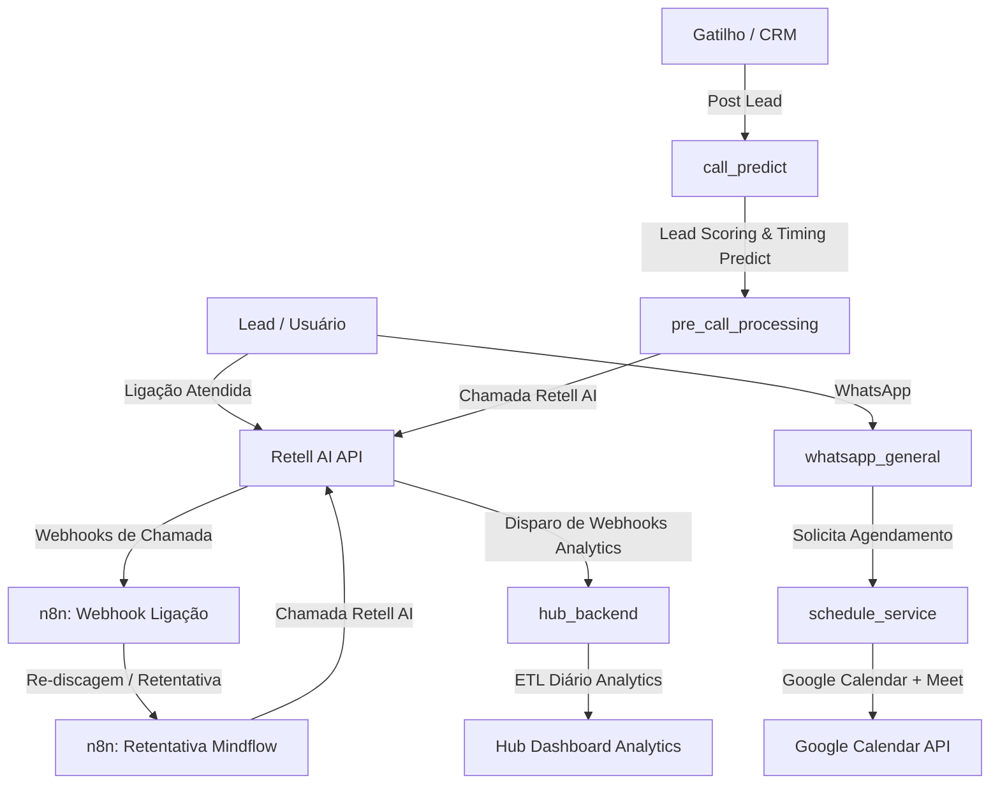

# MindFlow Microservices Reference Skill

Esta skill fornece documentação exaustiva, referências de API e mapeamentos de workflows dos microserviços em Python e fluxos customizáveis em n8n que compõem o ecossistema de automação de voz, WhatsApp, inteligência preditiva e agendamentos da **MindFlow**.

---

## 🧭 Visão Geral da Arquitetura de Microserviços e Automações

A plataforma MindFlow opera com microserviços orientados a eventos (EDW) integrados via **FastAPI**, **n8n Workflows**, **Redis (ARQ Workers)** e **Supabase Multi-Tenant**:

---

## 📂 Estrutura de Documentação por Microserviço e Serviço n8n

Consulte as subpastas abaixo para acessar a documentação técnica específica de cada serviço:

| Serviço / Microserviço | Base URL / Instância | Descrição Principal | Documentos |
| :--- | :--- | :--- | :--- |
| **`pre_call_processing`** | `https://call-github.bkpxmb.easypanel.host` | Processamento de chamadas individuais e em lote (CSV), higienização de dados, agendamento temporal no Redis e integração Retell AI. | [API Reference](file:///home/ryanf/Downloads/mind-all/Usefull_Skills/.agents/Skills/mindflow-services/pre_call_processing/api_reference.md) [Workflows e Arquitetura](file:///home/ryanf/Downloads/mind-all/Usefull_Skills/.agents/Skills/mindflow-services/pre_call_processing/workflows_and_architecture.md) |
| **`hub_backend`** | `https://hub-backend-github.bkpxmb.easypanel.host` | API REST de Analytics Multi-Tenant, ETL automático diário (3:00 AM BRT) e consolidação de métricas de chamadas, funil e conversão. | [API Reference](file:///home/ryanf/Downloads/mind-all/Usefull_Skills/.agents/Skills/mindflow-services/hub_backend/api_reference.md) [Workflows e Arquitetura](file:///home/ryanf/Downloads/mind-all/Usefull_Skills/.agents/Skills/mindflow-services/hub_backend/workflows_and_architecture.md) |
| **`schedule_service`** | `https://schedule-github.bkpxmb.easypanel.host` | Agendamento multi-tenant integrado ao Google Calendar (com Meet), verificação de horários livres, Z-API WhatsApp e servidor MCP. | [API Reference](file:///home/ryanf/Downloads/mind-all/Usefull_Skills/.agents/Skills/mindflow-services/schedule_service/api_reference.md) [Workflows e Arquitetura](file:///home/ryanf/Downloads/mind-all/Usefull_Skills/.agents/Skills/mindflow-services/schedule_service/workflows_and_architecture.md) |
| **`whatsapp_general`** | `https://whatsapp-github.bkpxmb.easypanel.host` | Plataforma multi-tenant de WhatsApp com Inbound Debounce (20s), transcrição Whisper, agente GPT-4/GPT-4o-mini, TTS e histórico persistente. | [API Reference](file:///home/ryanf/Downloads/mind-all/Usefull_Skills/.agents/Skills/mindflow-services/whatsapp_general/api_reference.md) [Workflows e Arquitetura](file:///home/ryanf/Downloads/mind-all/Usefull_Skills/.agents/Skills/mindflow-services/whatsapp_general/workflows_and_architecture.md) |
| **`call_predict`** | `https://call-predict-github.bkpxmb.easypanel.host` | Motor preditivo de ML (XGBoost Lead Scoring & Timing Predict) com workflow em 10 nós para qualificação e agendamento ideal de chamadas. | [API Reference](file:///home/ryanf/Downloads/mind-all/Usefull_Skills/.agents/Skills/mindflow-services/call_predict/api_reference.md) [Workflows e Arquitetura](file:///home/ryanf/Downloads/mind-all/Usefull_Skills/.agents/Skills/mindflow-services/call_predict/workflows_and_architecture.md) |
| **`n8n: Webhook Ligação`** | `https://n8n-mcp-n8n.bkpxmb.easypanel.host/webhook/...` | Workflow n8n para recepção de eventos Retell, persistência imediata em `Retell_calls_Mindflow`, filtro de sentimento e agendamento de retentativas. | [Documentação do Workflow](file:///home/ryanf/Downloads/mind-all/Usefull_Skills/.agents/Skills/mindflow-services/n8n_services/n8n_webhook_ligacao.md) |
| **`n8n: Retentativa Mindflow`** | Workflow n8n (ID: `B_AOhnNcx8fvQZusnu9N0`) | Workflow n8n de re-discagem com validação de reunião em `Retell_Leads_Midflow`, teto de 15 tentativas, janela de horário BRT (09h-19h) e chamada Retell. | [Documentação do Workflow](file:///home/ryanf/Downloads/mind-all/Usefull_Skills/.agents/Skills/mindflow-services/n8n_services/n8n_retentativa.md) |

---

## ⚡ Regras Globais de Qualidade e Rastreabilidade EDW

1. **Rastreabilidade Obrigatória:**
   - Todos os serviços salvam a execução mestre em `workflow_executions` com o `execution_id`.
   - Cada nó/passo individual grava em `workflow_step_executions` contendo `step_name`, `attempt` e `input_data`/`output_data`.
2. **Fusos Horários:**
   - **Banco de dados (Supabase/Postgres):** ISO 8601 em **UTC**.
   - **Lógica de negócios e agendamentos:** Fuso horário de **Brasília (`America/Sao_Paulo`)**.
3. **Formatação de Telefones:**
   - Sempre em formato E.164 iniciado por `+` (ex: `+5548999999999`).
