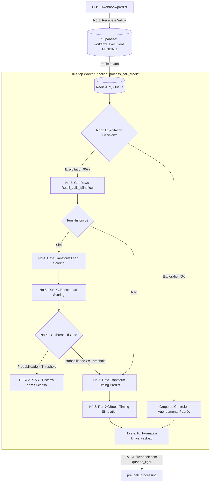

# Workflows e Arquitetura: `call_predict`

O `call_predict` é um microserviço em **FastAPI** e **ARQ (Redis Worker)** que executa um workflow de **10 nós rastreáveis no Supabase** com modelos de Machine Learning (**XGBoost**) para qualificação e agendamento inteligente de ligações.

---

## 🏗️ Arquitetura e Fluxo dos 10 Nós EDW

---

## 📑 Detalhamento dos 10 Nós de Execução

1. **`webhook_predict` (Nó 1):**
   - Valida se o número possui código internacional (`+55...`), insere o registro mestre `call_predict` na tabela `workflow_executions` com status `PENDING` e enfileira no Redis.

2. **`call_predict_exploitation` (Nó 2):**
   - Aplica taxa de exploração de grupo de controle (variável `EXPLORATION_RATE`, padrão `5%`). Se sorteado, desvia para o fluxo de grupo de controle sem inferência para validar eficácia do modelo.

3. **`call_predict_get_rows` (Nó 3):**
   - Busca até 150 ligações anteriores do mesmo número na tabela `Retell_calls_Mindflow` do Supabase. Deduplica os registros pelo `call_id` garantindo que cada evento seja considerado apenas uma vez.

4. **`call_predict_data_transform_ls` (Nó 4):**
   - Transforma os dados brutos de histórico do lead no vetor de features de **Lead Scoring** (`features_ls`), calculando métricas de tentativas prévias, recência e respostas anteriores.

5. **`call_predict_run_ls` (Nó 5):**
   - Executa inferência no modelo **XGBoost Lead Scoring** (`model_ls`).
   - Compara a probabilidade resultante contra a variável `LS_THRESHOLD` (padrão `0.0045`).

6. **`call_predict_ls_threshold` (Nó 6):**
   - Gatekeeper: Se a decisão for `DESCARTAR`, registra a inferência em `model_executions` e finaliza o workflow com status `SUCCESS` sem gerar ligação telefônica.

7. **`call_predict_data_transform_tp` (Nó 7):**
   - Transforma o histórico do lead e o horário atual no fuso de Brasília (`America/Sao_Paulo`) no vetor de features de **Timing Predict** (`features_tp`).

8. **`call_predict_run_tp` (Nó 8):**
   - Simula as probabilidades de atendimento para cada hora do dia no modelo **XGBoost Timing Predict** (`model_tp`) e escolhe o horário de pico ideal.
   - **Randomização de Minutos:** Aplica `minute = random.randint(1, 59)` na data/hora calculada para evitar sobrecarga (thundering herd) em horários redondos (ex: 14:00).

9. **`call_predict_send` (Nós 9 e 10):**
   - Monta o payload final injetando o campo `quando_ligar` em formato ISO 8601 com offset de fuso e efetua requisição HTTP `POST` autenticada no endpoint `/webhook` do microserviço `pre_call_processing`.
