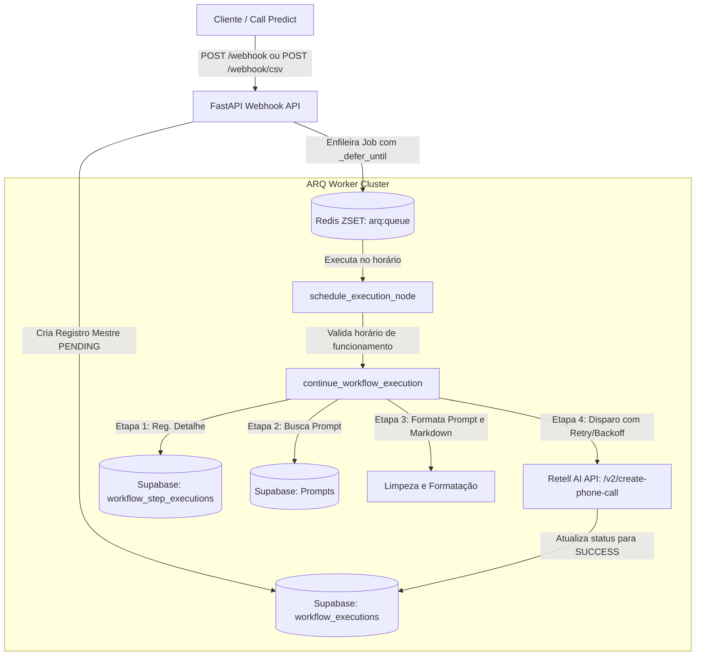

# Workflows e Arquitetura: `pre_call_processing`

O `pre_call_processing` é construído com **FastAPI** e **ARQ (Async Redis Queue)** seguindo o padrão de **Event-Driven Workflows (EDW)**. Ele garante rastreabilidade total de execuções no **Supabase**, suporte a agendamento temporal de ligações, disparos em massa via CSV e integração com a API da **Retell AI**.

---

## 🏗️ Arquitetura Interna

---

## 📑 Mapeamento de Tabelas do Supabase (EDW)

1. **`workflow_executions` (Mestre):**
   - `id`: UUID único da execução.
   - `workflow_name`: Nome do workflow (`pre_call_processing` ou `csv_scheduling`).
   - `trigger_event_id`: ID de rastreamento do evento disparador.
   - `status`: `PENDING`, `RUNNING`, `SUCCESS` ou `FAILED`.
   - `input_data`: Dicionário JSON com o payload original recebido.
   - `started_at` / `completed_at`: Timestamps em UTC.

2. **`workflow_step_executions` (Detalhe/Nós):**
   - `execution_id`: Foreign key apontando para a execução mestre.
   - `step_name`: Nome estruturado no padrão `{workflow_name}_{oqf}`.
     - `pre_call_processing_agendamento_redis`
     - `pre_call_processing_fetch_prompt`
     - `pre_call_processing_format_payload`
     - `pre_call_processing_create_retell_call`
   - `status`: `RUNNING`, `SUCCESS`, `FAILED`.
   - `attempt`: Número da tentativa atual (Retry com Exponential Backoff).
   - `input_data` / `output_data` / `error_details`: Dados de entrada, retorno e logs de erro.

---

## ⚡ Regras de Negócio e Funcionalidades Críticas

### 1. Higienização e Validação de Dados
- **Telefone:** Deve ser no formato internacional iniciado por `+` (ex: `+55...`).
- **E-mail:** E-mails nulos, vazios ou com apenas espaços são higienizados para o valor fallback `"."`. Pontuações soltas no final são rstripadas.
- **Nome:** Espaços em branco e pontuações remanescentes (`. - _ , ;`) são limpos automaticamente.

### 2. Agendamento Temporal e Horário Comercial (`adjust_to_business_hours`)
- Quando `quando_ligar` é informado (ou calculado em lote pelo CSV):
  - É convertido para o fuso horário de **Brasília (`America/Sao_Paulo`)**.
  - O sistema valida se o disparo cai entre `horario_inicio` e `horario_fim`.
  - Se o horário agendado for **após** `horario_fim`, o disparo é movido automaticamente para o início do dia útil seguinte (`horario_inicio`).
  - O agendamento persistente é mantido no **Redis** usando o parâmetro `_defer_until` do ARQ, garantindo tolerância a falhas e restarts do container.

### 3. Disparo de Lotes por CSV (`ingest_csv_batch`)
- O arquivo é lido em memória usando fluxo `io.StringIO`.
- As colunas adicionais não-padrão presentes no CSV são agrupadas e injetadas na string `contexto` do lead.
- Cada lead do CSV é enfileirado com a chave `job:{batch_id}:{lead_execution_id}`, permitindo cancelamento e reordenação granular de frequência via ZSET no Redis.

### 4. Kill-Switch (Cancelamento de Emergência)
- Quando o endpoint `/webhook/csv/cancel` é chamado, uma flag `batch:{batch_id}:status = cancelled` é gravada no Redis.
- O job `clean_cancelled_jobs` varre a fila `arq:queue`, remove as chaves do ZSET e deleta os metadados dos agendamentos em chunks (utilizando `scan`), interrompendo imediatamente novos disparos.

### 5. Tratamento de Rate Limits (Retell AI)
- Na chamada à API da Retell AI (`/v2/create-phone-call`), caso o código de resposta seja HTTP `429 (Rate Limit)`, o worker executa até 5 retentativas com **Exponential Backoff + Jitter** (`2^attempt + random`), evitando colisões (thundering herd).
