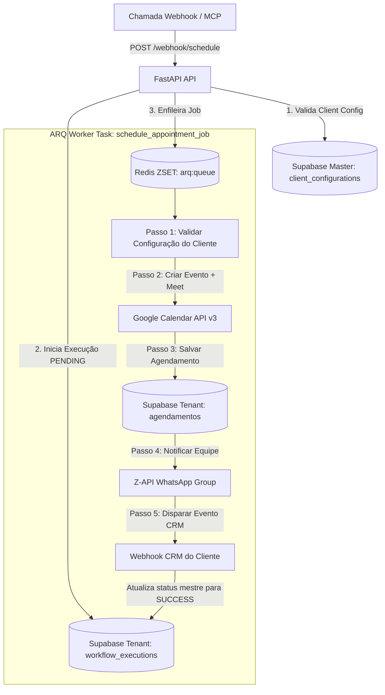

# Workflows e Arquitetura: `schedule_service`

O `schedule_service` é construído com **FastAPI**, **ARQ Worker (Redis)**, **Google Calendar API v3** e **Supabase Multi-Tenant**, seguindo a especificação de rastreabilidade **EDW**.

---

## 🏗️ Fluxo de Trabalho do Agendamento Assíncrono (`schedule_appointment_job`)

---

## 📑 Etapas Detalhadas de Execução (Rastreabilidade EDW)

Cada etapa do job do worker executa de forma retentativa e grava logs na tabela `workflow_step_executions` do banco Supabase do cliente correspondente:

1. **`scheduling_workflow_validate_client`:**
   - Carrega as credenciais de integração (`google_calendar_id`, tokens da Z-API e URL de Webhook do CRM) a partir da tabela `client_configurations` do Supabase Master.

2. **`scheduling_workflow_create_calendar_event`:**
   - Converte a data de agendamento para o fuso horário de **Brasília (`America/Sao_Paulo`)**.
   - Invoca a API do Google Calendar (`service.events().insert`) criando um evento de 1 hora com geração automática de sala no **Google Meet** (`hangoutsMeet`).

3. **`scheduling_workflow_upsert_lead_appointment`:**
   - Grava um novo registro na tabela `agendamentos` do cliente contendo nome, e-mail, telefone, data, `google_event_id`, `execution_id` e canal de contato.

4. **`scheduling_workflow_notify_whatsapp`:**
   - Formata mensagem amigável contendo nome do lead, e-mail, telefone, data/hora formatada em PT-BR e link direto do Google Meet.
   - Envia a mensagem para o grupo de WhatsApp da equipe cadastrado no cliente através da **Z-API** (`/send-messages`).

5. **`scheduling_workflow_send_to_crm`:**
   - Dispara webhook assíncrono informando ao CRM do cliente que o agendamento foi concluído com sucesso.

6. **Finalização:**
   - O status mestre em `workflow_executions` é atualizado para `SUCCESS` contendo o `meet_link`, `google_event_id` e `appointment_id`.
