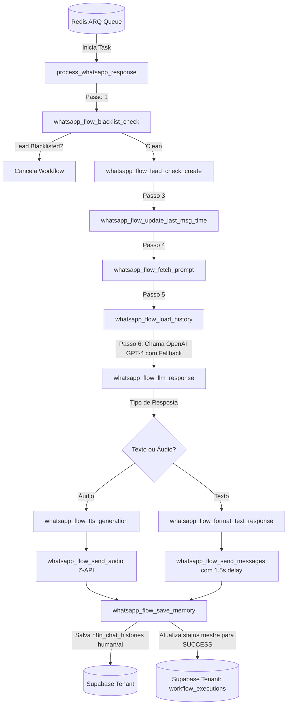

# Workflows e Arquitetura: `whatsapp_general`

O `whatsapp_general` implementa uma arquitetura resiliente baseada em **FastAPI**, **Redis Inbound Debounce**, **ARQ Workers**, **OpenAI Whisper/GPT-4** e **Supabase Multi-Tenant** sob as diretrizes de rastreabilidade **EDW**.

---

## 🏗️ Arquitetura de Recebimento e Debounce Redis

Para evitar que o robô envie múltiplas respostas separadas quando o usuário digita várias mensagens sequenciais no WhatsApp, o sistema utiliza o padrão **Redis Debounce**:

```mermaid
flowchart TD
    A[Z-API / CRM Webhook] -->|Mensagem de Entrada| B[FastAPI Endpoint]
    B -->|Sanitiza Telefone E.164 + Transcreve Áudio| C[NormalizedMessage]
    
    subgraph Inbound Debounce (20 segundos)
        C -->|1. RPUSH texto da mensagem| D[(Redis List: whatsapp_buffer:client:phone)]
        D -->|2. Tira Snapshot Inicial| E[pre_messages]
        E -->|3. Aguarda 20 segundos assíncronos| F[asyncio.sleep(20)]
        F -->|4. Tira Snapshot Final| G[post_messages]
    end
    
    G -->|pre_messages == post_messages?| H{Thread Vencedora?}
    H -->|Não| I[Descarta Thread - Outra requisição assumiu]
    H -->|Sim| J[Limpa Buffer + Concatena Mensagens]
    J -->|Cria Registro Mestre PENDING| K[(Supabase Tenant: workflow_executions)]
    J -->|Enfileira Worker Task| L[(Redis ZSET: arq:queue)]
```

---

## 🔄 Fluxo de Processamento do Worker (`process_whatsapp_response`)



---

## ⚡ Regras de Negócio e Funcionalidades Chave

1. **Transcrição Automática de Áudio:**
   - Mensagens de voz recebidas no formato `AUDIO` da Z-API têm a URL do arquivo extraída e enviada ao modelo **OpenAI Whisper** (`transcribe_audio`), convertendo a fala do lead em texto antes de entrar no buffer do Redis.

2. **Verificação de Blacklist:**
   - Antes de consumir tokens de IA, a tabela `Blacklist_Mindflow` é consultada. Se o número estiver bloqueado, a execução é encerrada com status `SUCCESS` e resultado `ignored_blacklisted`.

3. **Fallback Dinâmico de LLM:**
   - A chamada à IA tenta utilizar o modelo principal configurado no cliente (ex: `gpt-4` com temperatura `0.8`). Em caso de instabilidade da OpenAI ou limite de taxa, o sistema executa um fallback automático para `gpt-4o-mini` (temperatura `0.7`).

4. **Fragmentação de Respostas em Texto:**
   - Para simular digitação humana natural no WhatsApp, respostas em texto extensas são fragmentadas em pequenas mensagens por um nó formatador e enviadas sequencialmente com um intervalo de **1.5 segundos** entre cada envio.

5. **Memória de Conversa Persistente (`n8n_chat_histories`):**
   - As últimas 10 interações são recuperadas para compor o contexto do chat. Ao final do processamento, tanto a mensagem concatenada do usuário (`human`) quanto a resposta gerada (`ai`) são persistidas com timestamps UTC.
