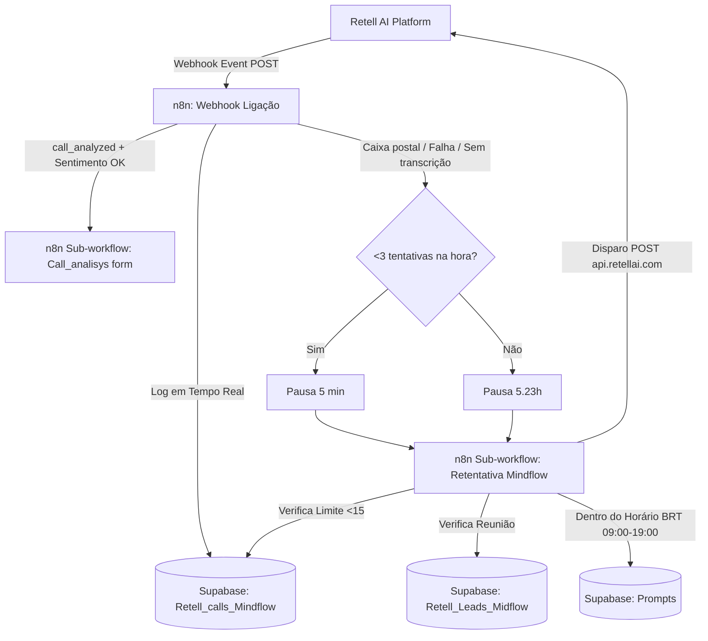

# Documentação de Serviços n8n (MindFlow EDW)

Este documento centraliza a visão geral e arquitetura dos fluxos n8n mantidos na infraestrutura da MindFlow. Estes fluxos são preservados em n8n por sua elevada customização em tempo real e não serão migrados para Python no momento.

---

## Workflows Mapeados

| Workflow | Tipo | Função Principal | Documentação Detalhada |
| :--- | :--- | :--- | :--- |
| **Webhook Ligação** | Webhook Receiver (HTTP POST) | Recebe eventos de ligação do Retell AI, salva log completo no Supabase (`Retell_calls_Mindflow`), roteia análises e agenda retentativas. | [n8n_webhook_ligacao.md](file:///home/ryanf/Downloads/mind-all/Usefull_Skills/.agents/Skills/mindflow-services/n8n_services/n8n_webhook_ligacao.md) |
| **Retentativa Mindflow** | Sub-workflow (`executeWorkflow`) | Controla políticas de re-discagem (verificação de reunião marcada em `Retell_Leads_Midflow`, teto de 15 tentativas, janela de horário BRT 09:00-19:00, montagem de prompt contextual e disparo na API Retell). | [n8n_retentativa.md](file:///home/ryanf/Downloads/mind-all/Usefull_Skills/.agents/Skills/mindflow-services/n8n_services/n8n_retentativa.md) |

---

## Integração com o Ecossistema MindFlow

